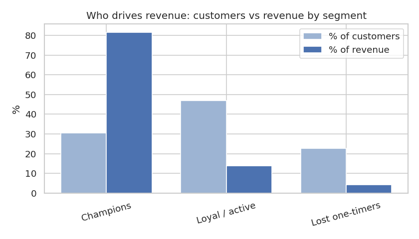

# Customer Segmentation with RFM and k-Means (UK Online Retailer)

Which customers drive revenue, and who should marketing prioritise for retention and who for win-back?
Customers are profiled on **Recency, Frequency and Monetary value (RFM)** and grouped with k-means.



## Result: 30% of customers bring in 82% of revenue

4,338 identified customers, 18,532 completed invoices, £8.9M revenue (Dec 2010 – Dec 2011):

| Segment | Customers | % of customers | % of revenue | Median days since last order | Median orders | Median spend |
|---|---|---|---|---|---|---|
| **Champions** | 1,324 | 30.5% | **81.6%** | 17 | 7 | £2,575 |
| Loyal / active | 2,032 | 46.8% | 14.0% | 45 | 2 | £509 |
| Lost one-timers | 982 | 22.6% | 4.4% | 253 | 1 | £293 |

**What to do with it:**
- **Champions:** protect this group (VIP service, early access). Losing a few of these customers costs more than losing the whole bottom segment.
- **Loyal / active:** the growth lever. Moving them from 2 orders to 3–4, through replenishment reminders and bundles, is the cheapest revenue available.
- **Lost one-timers:** one order about 8 months ago. Try a single low-cost win-back campaign, then stop spending on them.

k = 3 was chosen by silhouette score (0.411; k = 2 ties but is too coarse to act on, and scores fall for k ≥ 4).

## Method

1. Keep identified customers (24.9% of lines have no CustomerID) and completed sales only: exclude cancellations (`C` invoices), returns, and zero prices.
2. Build RFM per customer: recency in days, frequency as **distinct invoices**, monetary as total spend.
3. Log-transform frequency and spend (heavily skewed: the median customer spends £675, the top spends £280k), then standardise.
4. Pick k with silhouette scores, fit k-means, and profile segments with medians and revenue share.

## Fixes from the first version

The original notebook (in `archive/`) had four problems:
- **Misaligned labels.** Cluster labels were attached with `pd.concat(axis=1)` to a DataFrame whose index had gaps after outlier removal. Labels didn't line up with customers, which is why all five of its clusters showed nearly identical averages.
- **High-value customers dropped.** It removed IQR outliers in spend and frequency, which throws away exactly the customers that matter most.
- **Frequency miscounted.** It counted invoice lines instead of orders.
- **Returns included.** Cancellations were kept, producing customers with £0 spend.

The old README also mixed up the methods ("hierarchical clustering … using k-means"). This version uses k-means, with the number of clusters chosen by silhouette score.

## Run it

```bash
pip install -r requirements.txt
# put "Online Retail.csv" in data/ (see data/README.md)
jupyter nbconvert --to notebook --execute rfm_segmentation.ipynb   # ~10 s
```

Tools: pandas, scikit-learn (k-means, silhouette), matplotlib/seaborn.
